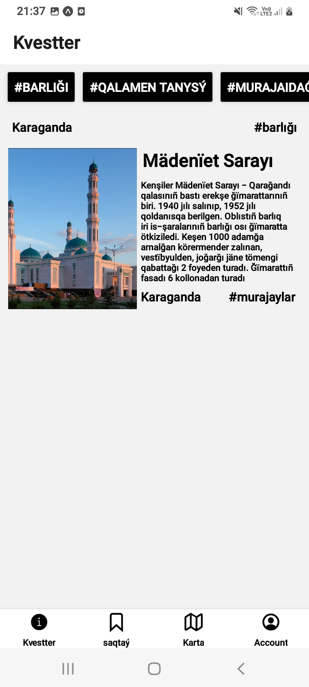
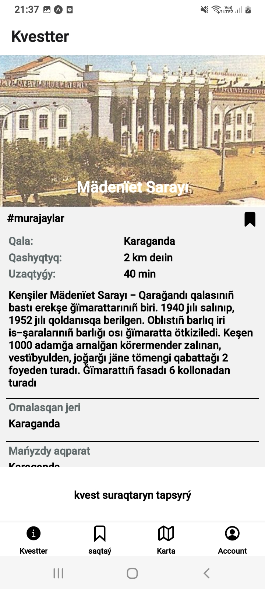
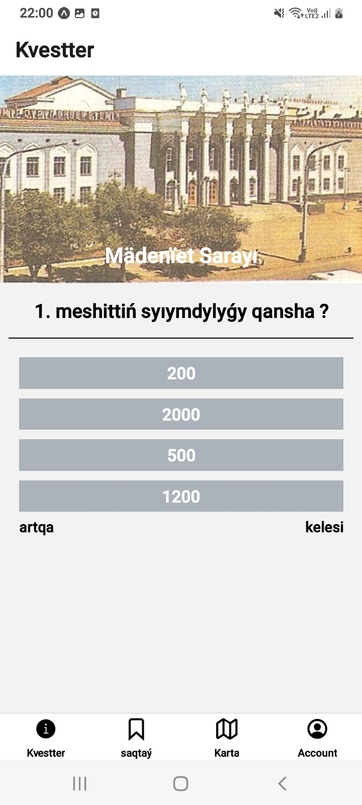
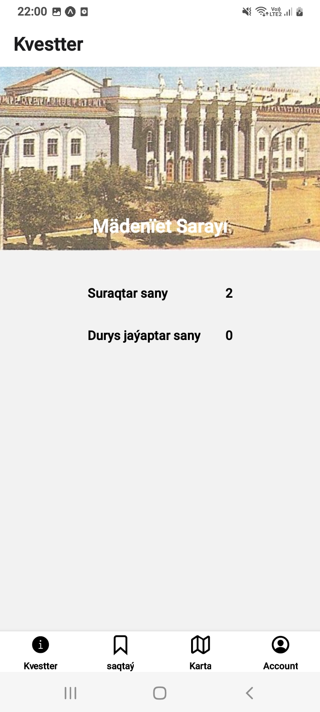
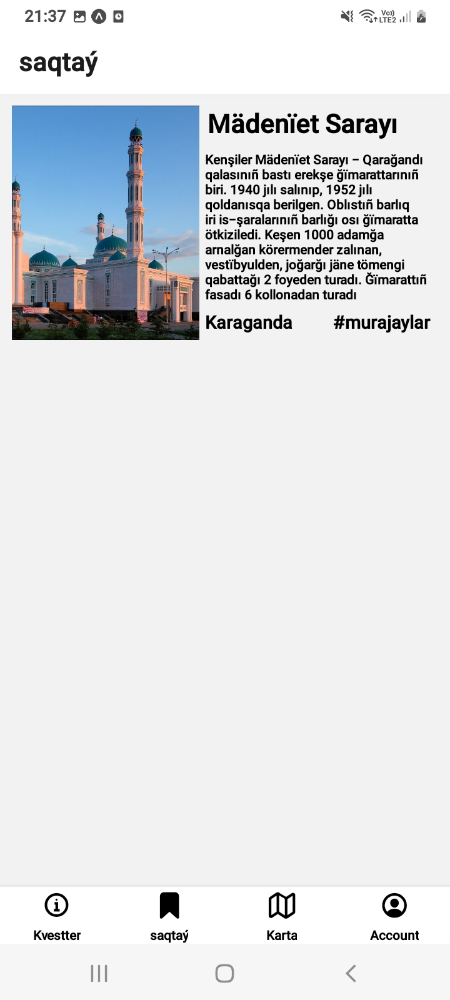
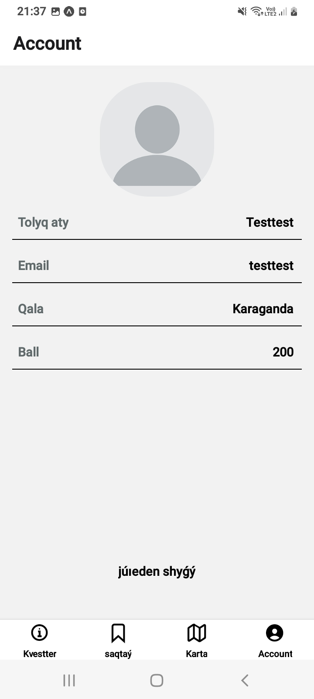

# QUESTERI

TOOL

- [node v16.17.0](https://nodejs.org/en/)
- [React](https://reactjs.org/)
- [React Native](https://reactnative.dev/)
- [React Navigation](https://reactnavigation.org/)
- [Expo](https://expo.dev/)

STEP 1

To start the server from first you need to download the dependencies
````
npm install
````
after download dependency
````
npm start
````

STEP 2

to launch the mobile application

first 
````
cd app
````
and
````
npm install
````

start

with QR Code 
````
npm start
````
with USB
````
expo start --localhost --android
````

## MENU 
> Quester




> Tests




> Saved



> Account


